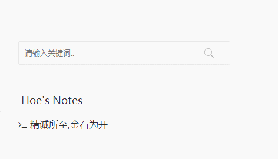

### 打字特效插件`ActivatePowerMode`

#### 使用方法

- 下载本插件，解压放到`usr/plugins/`目录中
- 文件夹名改为`ActivatePowerMode`
- 登录管理后台，激活插件

#### 插件说明
插件基于`activate-power-mode.js`

#### 联系作者
- Email:`i@hoehub.com`
- 欢迎访问 www.hoehub.com 一起学习讨论

### 许可证 License

- 本项目遵循GPL-3.0开源协议发布。
- 版权所有Copyright © 2018 by Hoe (http://www.hoehub.com)
- All rights reserved。